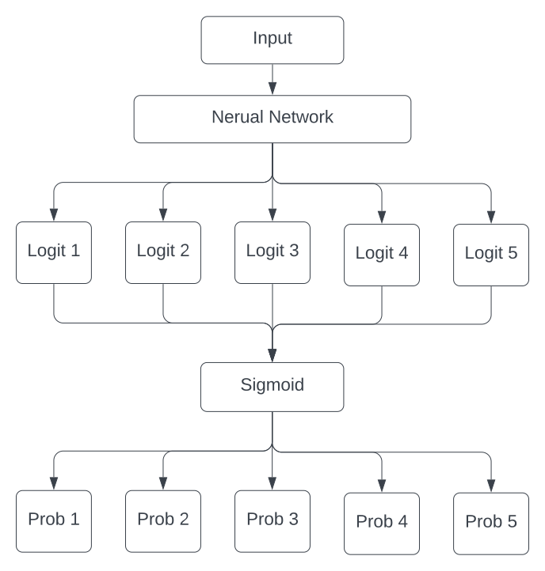

# Multilabel 

## Introduction

The Multilabel design pattern refers to problems where we can assign more than one label to a given training example. For neural network, this design requires changing the activation function used in the final output layer. It is common to use softmax as the activation function in the output layer, where the sum of all the predicted values adds up to one, for classification problems that each sample can only have one label. For scenarios where each trainning example can be assigned to more than one label, the activation function needs to be changed.

## Youtube

[What is Multilabel Classification in Machine Learning?](https://www.youtube.com/watch?v=qMhNYVJH5Ag)

## Rational

The rational behind the Multilabel design pattern is to address problems where the model needs to determine more than one predictions. Examples are predicting multiple tags of an image, identify multiple objects in a single image, predicting all potential health risks given data of a patient. By changing the activation function in the output layer of the nerual network, the probabilities of different labels can be predicted. A commonly used activation function is sigmoid, where the value of each label is between 0 and 1.

## Softmax vs Sigmoid

Say we have an image that contains a cat and a dog. Our possible classes are cat, dog and rabbit. The prediction of the different activation function might look something like this:

||Cat|Dog|Rabbit|
|---|----|----|----|
|Softmax|0.8|0.15|0.05|
|Sigmoid|0.95|0.89|0.15|

For Softmax, the values add up to one.

For Sigmoid, each value is between zero to one.

## Diagram



## Simple Code: [multilabel.py](./multilabel.py)

``` python
import numpy as np 
import random 

class NeuralNetwork:
    
    numLabel = 3
    threshold = 0.68
    
    def predict(self, input):
        
        logits = []
        # simulating NN layers
        for i in range(0, self.numLabel):
            logits.append(((input[i] - input[i+1])) / 14)
        
        probs = self.output(logits)
        
        return probs
    
    def output(self, logits):
        #output layer
        probs = [self.activationFunction(x) for x in logits]
        return probs
    
    def activationFunction(self, x):
        # Sigmoid 
        return 1/(1 + np.exp(-x))

def generateData(n):
    # generate n records of data
    random.seed(42)
    return [[random.randint(0, 100) for _ in range(5)] for i in range(0,n)]


nn = NeuralNetwork()

dataset = generateData(5)

for i, data in enumerate(dataset):
    probs = nn.predict(data)
    labels = [ 1 if prob > nn.threshold else 0 for prob in probs]
    print(f"Dataset #{i+1:2} prediction: {labels} with probabilities {[round(prob, 2) for prob in probs] }")

```

### Output:

```
Dataset # 1 prediction: [1, 1, 0] with probabilities [0.99, 0.69, 0.0]
Dataset # 2 prediction: [0, 1, 0] with probabilities [0.55, 0.69, 0.0]
Dataset # 3 prediction: [0, 1, 1] with probabilities [0.36, 0.86, 0.98]
Dataset # 4 prediction: [1, 0, 0] with probabilities [0.97, 0.52, 0.36]
Dataset # 5 prediction: [0, 0, 1] with probabilities [0.08, 0.28, 0.99]
```

## Common Usage

The following are some common usages of the multilabel pattern:

1. **Image Classification**: Multilabel classification is widely used in image classification to identify multiple objects in the image or give the image multiple tags.
2. **Health Risk Prediction**: In medical sector, multilabel classification is also widely used to detect all possible health risks of the patients.
3. **Text Labeling**: Multilabel can also be used to identify the emotion of the text or classify the text with multiple labels, such as labeling comments. 


## Complex Code Problem: [image_classification.py](./image_classification.py)

``` python
from tensorflow.keras import Sequential
from tensorflow.keras.layers import Flatten, Dense, Dropout, BatchNormalization, Conv2D, MaxPool2D
from tensorflow.keras.optimizers import Adam
from tensorflow.keras.preprocessing import image
import numpy as np
import pandas as pd
from sklearn.model_selection import train_test_split
from tqdm import tqdm


class ImageClassifier:

    img_width = 350
    img_height = 350
    num_label = 0
  

    def __init__(self, dataset):
      self.readDataset(dataset)
  
      self.num_label = len(self.data.columns[2:])
      self.labels = self.data.columns[2:]
      print(f"Image labels: {self.labels}")
      X = self.getImageData()
      y = self.data.drop(['Id', 'Genre'], axis = 1)
      y = y.to_numpy()
      X_train, X_test, y_train, y_test = train_test_split(X, y, random_state=0, test_size = 0.1)
      self.model = self.constructNN(X_train[0].shape)
      self.train(self.model, X_train, y_train, X_test, y_test)

    def readDataset(self, path):
        data = pd.read_csv(path)
        self.data = data.drop(data.index[700:], axis=0)
        print("Data imported successfully")

    def processImg(self, path):
        img = image.load_img(path, target_size=(self.img_width, self.img_height, 3))
        img = image.img_to_array(img)
        img = img/255.0
        return img
    
    def getImageData(self):
        X = []
        for i in tqdm(range(self.data.shape[0])):
            path = './Images/'+self.data['Id'][i] + ".jpg"
            img = self.processImg(path)
            X.append(img)

        X = np.array(X)
        return X
        
    def constructNN(self, input_shape):
        ## Nerual Network
        model = Sequential()
        # input - conv - BN - ReLu - Max Pool
        # 1st layer
        model.add(Conv2D(16, (3,3), activation='relu', input_shape = input_shape ))
        model.add(BatchNormalization())
        model.add(MaxPool2D(2,2))
        model.add(Dropout(0.1))
        # 2nd layer
        model.add(Conv2D(32, (3,3), activation='relu'))
        model.add(BatchNormalization())
        model.add(MaxPool2D(2,2))
        model.add(Dropout(0.2))
        # 3rd layer
        model.add(Conv2D(64, (3,3), activation='relu'))
        model.add(BatchNormalization())
        model.add(MaxPool2D(2,2))
        model.add(Dropout(0.3))
        # 4th layer
        model.add(Conv2D(128, (3,3), activation='relu'))
        model.add(BatchNormalization())
        model.add(MaxPool2D(2,2))
        model.add(Dropout(0.4))

        model.add(Flatten())
        # fully connected layers
        model.add(Dense(128, activation='relu'))
        model.add(BatchNormalization())
        model.add(Dropout(0.50))

        # output layer -> sigmoid for multilabel
        model.add(Dense(self.num_label, activation='sigmoid'))
        # model.summary()
        return model

    def train(self, model, X_train, y_train, X_test, y_test):
        print("Training model...")
        model.compile(optimizer='adam', loss='binary_crossentropy', metrics=['accuracy'])
        model.fit(X_train, y_train, epochs=10, validation_data=(X_test, y_test))

    def predict(self, img_path):
        img = self.processImg(img_path)
        img = img.reshape(1, self.img_width, self.img_height, 3)
        y_prob = self.model.predict(img)
        predictions = np.argsort(y_prob[0])[:-4:-1]
        predictions = [ f"{self.labels[predictions[i]]}: {y_prob[0][predictions[i]]:.2}"  for i in range(3) ]
        print("\n" + "#"*90 + "\n")
        print(f"Prediction Result: {predictions}")
        print("\n"+ "#"*90 + "\n")

def main():
  image_classifier = ImageClassifier('./train.csv')
  path = './fast.jpg'
  image_classifier.predict(path)

if __name__ == "__main__":
  main()


```